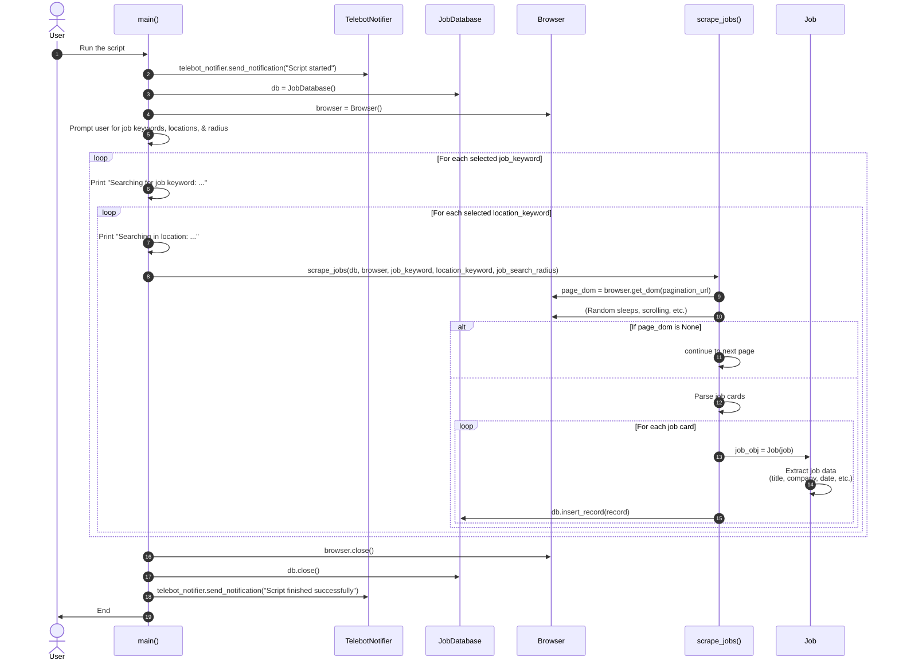

## Introduction

Job hunting is like online dating: it’s all about finding the right match before someone else swoops in. But instead of endlessly swiping (or scrolling), what if you could automate the process and get all the juicy details delivered to you on a silver platter? That’s the magic of web scraping, and today, we’re diving into building a job posting scraper with Python.

Whether you’re a scraping newbie or an enthusiast looking to up your game, this guide will take you from zero to hero, one job listing at a time. By the end, you’ll have a fully functional tool that fetches the latest job opportunities and notifies you in real-time. Let’s go! 🚀

## Why Scraping?🤔

Imagine waking up each morning with a fresh list of job opportunities—tailored to your preferences. No more manually sifting through job boards or missing out because you forgot to check. With a scraper:
- **Save Time**: Automate repetitive searches.
- **Get Organized**: Store job data neatly for analysis.
- **Stay Ahead**: Receive real-time updates on the hottest listings.

This tool isn’t just about automation—it’s about empowerment. You control the job search process while letting the script handle the tedious parts.

## The Tech Stack

Here’s what powers our job scraper:
- **Python**: The heart of the operation.
- **Undetected ChromeDriver**: Bypasses pesky anti-bot measures by pretending to be a human.
- **BeautifulSoup & lxml**: Extracts meaningful data from HTML chaos.
- **Psycopg2**: Talks to PostgreSQL, where we store all the data.
- **Telebot**: Notifies you via Telegram, because who doesn’t love instant updates?
- **D3j**: The beautiful and elegent part of visualization.

## Let’s Build It 🚀

Below is a sequence diagram that represents the entire scrapping process.



### Step 1: Setting Up the Browser  🌐

Most job boards actively block bots. Undetected ChromeDriver ensures our scraper behaves like a real human. By randomizing user agents and browser behaviors, we stay under the radar.

```python
import undetected_chromedriver as uc
import random
import time

class Browser:
    def __init__(self):
        self.browser = self.get_browser()

    def get_browser(self):
        user_agents = [
            "Mozilla/5.0 (Windows NT 10.0; Win64; x64)...",
            "Mozilla/5.0 (Macintosh; Intel Mac OS X 10_15_7)...",
        ]
        options = uc.ChromeOptions()
        options.add_argument(f"--user-agent={random.choice(user_agents)}")
        options.add_argument("--window-size=1920,1080")
        options.add_argument("--disable-blink-features=AutomationControlled")
        browser = uc.Chrome(options=options, headless=False)
        return browser

    def get_dom(self, url):
        try:
            self.browser.get(url)
            time.sleep(random.randint(5, 10))
            return self.browser.page_source
        except Exception as e:
            print(f"Error fetching URL {url}: {e}")
            return None
```
> ##### Why Using Delays?
>
> Random pauses mimic natural browsing behavior and reduce the risk of detection. If you’re feeling fancy, you could even simulate mouse movements and clicks for added realism.
>
> {: .block-blue }

### Step 2: Scraping the Listings📋

Using **lxml**, we extract job titles, companies, locations, and descriptions from the page. It’s like finding the signal in the noise, but make it Pythonic.

```python
from lxml import etree as et

class Job:
    def __init__(self, job_element):
        self.job = job_element

    def get_job_title(self):
        try:
            return self.job.xpath(".//a[@class='job-title']/span/text()")[0]
        except IndexError:
            return "Not available"

    def get_company_name(self):
        try:
            return self.job.xpath(".//span[@class='company-name']/text()")[0].strip()
        except IndexError:
            return "Not available"

    def get_job_description(self):
        try:
            return " ".join(self.job.xpath(".//div[@class='job-description']/text()"))
        except IndexError:
            return "Not available"
```
> ##### Quick Tip
>
> If the website structure changes, these XPath selectors may break. Regularly test your scraper to ensure compatibility.
>
> {: .block-blue }

### Step 3: Storing the Data 🗄️

With PostgreSQL, we can store job listings in a structured format for easy querying and analysis. This design allows you to track trends over time.

```python
import psycopg2
class JobDatabase:
    def __init__(self):
        self.conn = psycopg2.connect(
            dbname="jobs_db",
            user="user",
            password="password",
            host="localhost"
        )
        self.create_table()

    def create_table(self):
        with self.conn.cursor() as cur:
            cur.execute("""
                CREATE TABLE IF NOT EXISTS jobs (
                    id SERIAL PRIMARY KEY,
                    title TEXT,
                    company TEXT,
                    description TEXT,
                    scraped_at TIMESTAMP DEFAULT CURRENT_TIMESTAMP
                )
            """)
            self.conn.commit()

    def insert_record(self, job_data):
        with self.conn.cursor() as cur:
            cur.execute("""
                INSERT INTO jobs (title, company, description)
                VALUES (%s, %s, %s)
            """, job_data)
            self.conn.commit()
```
#### Step 4: Notifications via Telegram 📲

Who wouldn’t want their scraper to double as a personal assistant? With Telebot, get instant alerts about job postings on your Telegram.

```python
import telebot
import os

class TelebotNotifier:
    def __init__(self):
        self.bot_token = os.getenv('TELEBOT_TOKEN')
        self.chat_id = os.getenv('TELEBOT_CHAT_ID')
        self.bot = telebot.TeleBot(self.bot_token)

    def send_notification(self, message):
        try:
            self.bot.send_message(self.chat_id, message)
        except Exception as e:
            print(f"Failed to send notification: {e}")
```
#### Step 5: Scraping in Action 🎬

Now, we stitch it all together into a scraper that fetches job listings, stores them, and keeps you updated.
```python
def scrape_jobs(browser, db, notifier):
    url = "https://www.indeed.com/jobs?q=developer&l=remote"
    page_source = browser.get_dom(url)
    dom = et.HTML(page_source)
    job_elements = dom.xpath("//div[@class='job_seen_beacon']")

    for job_element in job_elements:
        job = Job(job_element)
        title = job.get_job_title()
        company = job.get_company_name()
        description = job.get_job_description()

        db.insert_record((title, company, description))
        notifier.send_notification(f"New Job: {title} at {company}")
        print(f"Processed: {title} at {company}")

def main():
    db = JobDatabase()
    browser = Browser()
    notifier = TelebotNotifier()

    scrape_jobs(browser, db, notifier)

    browser.browser.quit()
    db.conn.close()
```
### Challenges and How We Solved Them  🔧

#### 1. Anti-Bot Measures
- Randomized user agents, browser options, and delays.
- Used **Undetected ChromeDriver** to blend in with regular users.

#### 2. Data Duplication

Before inserting data into the database, ensure no duplicate entries exist by querying for existing job titles.
> ##### Tips
> Prevent duplicate entries by creating unique constraints in your database:
> ```sql 
> ALTER TABLE jobs ADD CONSTRAINT unique_job UNIQUE (title, company);
> ```
> {: .block-blue }

#### 3. Dynamic Web Pages

By using browser.get_dom with Selenium, we ensure the entire page loads before scraping.

### Ethical Web Scraping 🌐

Web scraping is powerful, but it comes with responsibilities:
1. **Follow Terms of Service**: Always check the website’s rules before scraping.
2. **Be Polite**: Use delays to avoid overwhelming servers.
3. **Respect Privacy**: Never scrape or use personal data without consent.

## Visualizations

Visualization is a key part of making the data more accessible and actionable. In this project, I leveraged D3.js, a JavaScript library for producing dynamic, interactive data visualizations in the browser. The two core visualizations include:
1. GeoMap: Highlights job posting activity by region.
2. Word Cloud: Showcases the frequency of company names based on job postings.

These visualizations transform raw, tabular job data into visually intuitive representations, making it easier to uncover trends and insights.

### GeoMap: Visualizing Regional Job Trends 🗺️

The GeoMap provides a regional overview of job posting activity, helping users identify hotspots for job opportunities.

#### How It Was Built
1. **GeoJSON Data**:
    - A GeoJSON file containing the geographical coordinates of U.S. states was used as the base map.
    - Each region was linked with job counts processed from the PostgreSQL database.
2. **D3.js Mapping**:
    - D3’s `geoPath` function was used to project the GeoJSON data onto an SVG canvas.
    - A choropleth color scale (`d3.scaleSequential`) was applied, where darker shades represent regions with higher job posting activity.
3. **Interactive Tooltips**:
    - When hovering over a state, the tooltip displays the number of job postings in that region.

<div id="chart-job-map"></div>

<!-- Add TopoJSON -->
<script src="https://d3js.org/topojson.v3.min.js"></script>

<script src="{{ '/assets/js/chart/chart-job-map.js' | relative_url }}" defer></script>
<script>
  document.addEventListener('DOMContentLoaded', function () {
    if (typeof renderJobMap === 'function') {
      renderJobMap(
        '#chart-job-map', 
        '../assets/json/formatted.csv', 
        'Job Posting Visualization'
      ); // Call the function
    } else {
      console.error("Function 'renderJobMap' is not defined.");
    }
  });
</script>

### Word Cloud

The Word Cloud focuses on employer frequency, visually showing which companies are posting the most jobs.
#### How It Was Built

1. **Data Preprocessing**:
    - Job data was grouped by company name, with each name assigned a frequency count.
    - Special characters (+) in company names were replaced with spaces for readability.

2. **Dynamic Updates**:
    - The word cloud is connected to a scrubber widget that allows users to cycle through timestamps of job postings.
    - As the scrubber moves, the word cloud dynamically updates to reflect the most active companies at that time.

3. **D3 Cloud Layout**:
    - Word sizes were scaled using `Math.sqrt(frequency) * 20`, ensuring more frequent companies are visually prominent.
    - Words were randomly rotated for visual variety.


<div id="chart-word-cloud"></div>
<!--Import D3 Cloud -->
<script src="https://cdn.jsdelivr.net/npm/d3-cloud@1.2.7/build/d3.layout.cloud.min.js"></script>
<script src="{{ '/assets/js/chart/chart-word-cloud.js' | relative_url }}" defer></script>
<script>
  document.addEventListener('DOMContentLoaded', function () {
    if (typeof renderWordCloudChart === 'function') {
      renderWordCloudChart('#chart-word-cloud');
    } else {
      console.error("Function 'renderWordCloudChart' is not defined.");
    }
  });
</script>

## Conclusion 🎉

And there you have it—a full-fledged Python scraper to tame the chaotic job market! This script not only fetches job postings but also transforms them into actionable insights, all while notifying you in real-time.

So, what’s next? Scale it up to scrape multiple job boards, build analytics dashboards, or even integrate with a resume uploader for semi-automated job applications. Happy scraping!