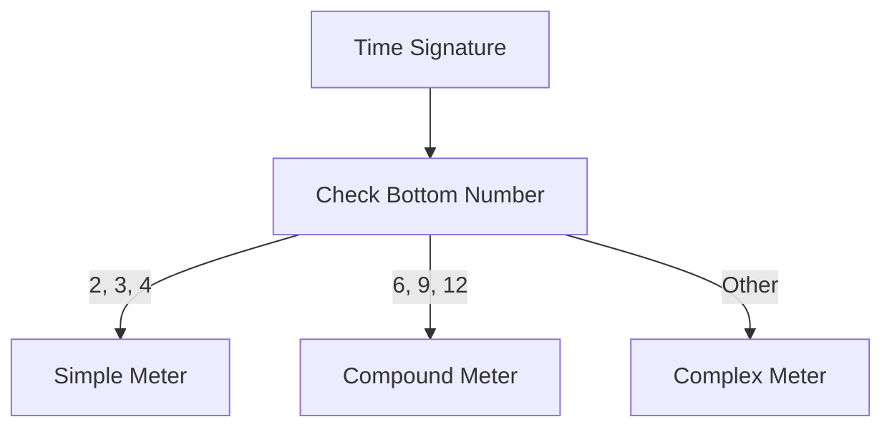
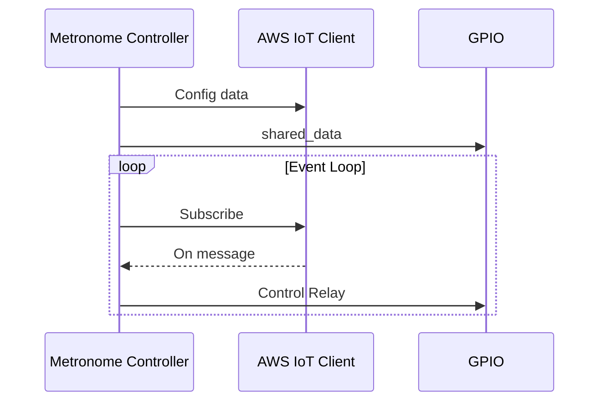
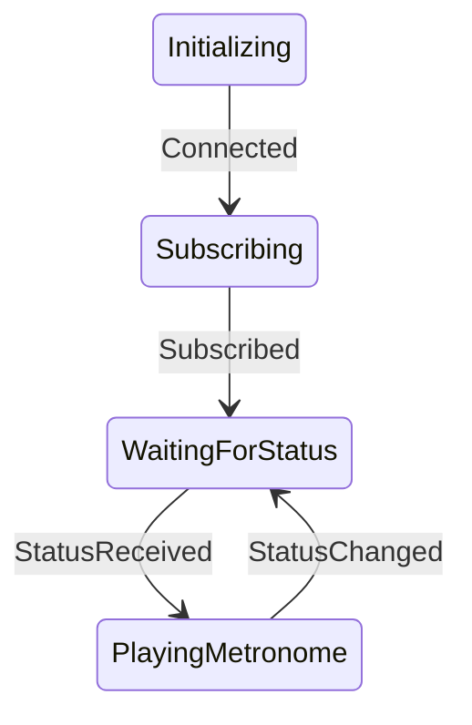

<div class="row">
    <div class="col-sm mt-3 mt-md-0">
        
    </div>
</div>
<div class="caption">
    PulsePace Featured Image
</div>
# Introduction

Musicians often struggle to maintain accurate rhythm during performances, a challenge that is typically overcome with the help of metronomes. However, conventional metronomes rely on sound or light cues to guide musicians, which can be distracting and difficult to follow. In this project, a novel approach is proposed that utilizes Transcutaneous Electrical Nerve Stimulation (TENS) technology instead of traditional cues. A TENS unit is a small, battery-operated device that delivers electrical impulses to the nerves and muscles through electrodes attached to the skin. This approach aims to develop a unique metronome that can provide more precise and intuitive guidance to musicians. The project objectives will be discussed in detail later in this section.

Existing metronomes rely on visual or auditory cues, which can be distracting for both performers and audience members. For instance, during a live performance of Les Misérables, I noticed the conductor's screen, which was used to guide the performers in keeping time. The screen's light drew my attention, taking me away from the immersive experience. By employing a TENS unit to stimulate the muscles, performers can discreetly receive rhythmic guidance without drawing attention from the audience or disrupting the flow of the music.

This TENS-based metronome aims to revolutionize the way musicians maintain rhythm, offering a more subtle and efficient alternative to conventional devices. By eliminating potential distractions caused by light or sound, this innovative approach promises to enhance the overall performance experience for both musicians and audiences alike.

In addition, musicians may experience muscle tension during extended periods of practice, which can negatively impact their performance. By using a TENS unit in conjunction with a metronome during practice, musicians can promote muscle relaxation and reduce tension. This can help them feel more relaxed and comfortable while practicing, leading to better performance outcomes.

**There is a crazier idea that popped into my mind. There are some sensors that can capture the electrical signals in muscles. What if we use these sensors to capture the muscle signals in various parts of a teacher's hands and convert them into the same type of stimulation that can be transmitted to a TENS unit, allowing students to feel what correct playing is like? This way, students can learn to play more quickly and effectively, and it may also offer potential benefits for remote learning.**

## Project Objectives

The objective of this project is to build a metronome using a TENS unit in combination with a Raspberry Pi 4 Model B and a Seeed Studios COM22639P Grove Module Relay. The metronome will be designed to read from a MIDI file to retrieve the rhythm pattern and generate signals for the TENS unit to stimulate the muscles of musicians. The specific goals of this project include:

1. Developing a software program that can read MIDI files and extract the rhythm pattern for use with the TENS unit.
2. Building a hardware interface between the Raspberry Pi 4 and the TENS unit, using the Grove Module Relay to control the output signals.
3. Designing and testing the metronome to ensure that it accurately reproduces the rhythm pattern from the MIDI file and provides effective muscle stimulation for musicians.
4. Leaving a backdoor for myself just in case that if a musician pisses me off, I can infiltrate the metronome and turn up the voltage to provide him/her/them/it with an unique opportunity to feel Pikachu's extraordinary abilities.

By achieving these objectives, this project will provide a novel and innovative tool for musicians to develop muscle memory and improve their performance skills, while also promoting better physical health and reducing the risk of injury.

## Scope and Limitations

The TENS Metronome project has certain limitations, which are outlined below:

1. The effectiveness of muscle stimulation from the TENS unit in building muscle memory for musicians is not yet well-established and requires further research.
2. The use of a TENS unit may interfere with other medical devices, such as pacemakers, and may not be suitable for musicians with such conditions.
3. TENS units require adhesive pads to be attached to the skin, which may not adhere properly for individuals with excessive sweating.
4. Adding wireless communication functionality to the device may create security vulnerabilities, potentially leading to harm from the strong pulse emitted by the TENS unit.
5. Some music pieces may not have corresponding MIDI files, requiring additional work, such as optical character recognition (OCR) transcribing, to generate the required rhythm pattern for the TENS metronome.

These limitations should be taken into consideration during the development and implementation of the TENS metronome project to ensure the safety and effectiveness of the device for musicians.

# But first, Music Theory

**Note:** _Hey, buckle up and brace yourself for some bumpy reading! Bracelet yourselves, folks, 'cause this part might have a few juicy tidbits of misinformation. So, put on your detective hats, grab a magnifying glass, and scrutinize me like a judge on a reality show. Go ahead, roast me, but make sure to sprinkle it with a generous dose of sugar-coated niceness!_

## Meters

In music theory, a meter (or time signature) is a notation used to indicate the rhythm of a piece of music. It consists of two numbers written as a fraction, typically appearing at the beginning of a piece of sheet music. The top number represents the number of beats in each measure, while the bottom number represents the type of note that receives one beat. For example, in the common time signature 4/4, there are four beats per measure, and a quarter note receives one beat.

### Types of Meters

Meters can be classified into several categories based on the number of beats per measure and the type of note that receives one beat. The most common meters are:

1. Simple meters: these meters have two, three, or four beats per measure, with each beat divided into two equal parts. Examples include 2/4, 3/4, and 4/4.
2. Compound meters: these meters have six, nine, or twelve beats per measure, with each beat divided into three equal parts. Examples include 6/8, 9/8, and 12/8.
3. Complex meters: these meters have an irregular number of beats per measure, or beats that are divided into an irregular number of parts. Examples include 5/4, 7/8, and 11/16.



In the flowchart above, a method is shown to help understand a function in the Software section. Keep in mind that this flowchart doesn't provide a flawless method for determining whether a meter is simple or compound. There may still be exceptions, such as simple duple, that are not covered by the flowchart.

### Strong and Weak Beats

In addition to the number of beats and their subdivisions, meters also have a characteristic "feel" or "groove" that depends on the pattern of strong and weak beats within a measure. The pattern of strong and weak beats is determined by the meter and is often indicated by conducting patterns, drum patterns, or other rhythmic notation.

### Role in Music

Meters play a fundamental role in music, providing a structure for the rhythm and helping to establish the overall feel and character of a piece. They are also an important tool for composers and arrangers, who use them to create a sense of tension, release, and rhythmic interest.

Overall, understanding meters is essential for anyone studying or performing music, as it provides a foundation for interpreting and expressing the rhythm and feel of a piece.

## Orchestra Size And Settings

An orchestra refers to a well-structured assembly of musicians who play music composed specifically for the instruments or groups of instruments that make up the orchestra. The beauty of orchestral music can only be fully appreciated when the entire group plays together in the way the composer intended. Normally, a conductor guides the performance.

This would help to determine what type of connectivity technology would be needed for this project.

### Composition and Size of Selected Orchestras Through the Centuries

| Date      | City and Orchestra                 | V   | Va  | C   | DB  | F   | O   | Cl  | B   | Ho  | Tr  | T/T | Ti  | Pc  | K   | Ha  | Total |
| --------- | ---------------------------------- | --- | --- | --- | --- | --- | --- | --- | --- | --- | --- | --- | --- | --- | --- | --- | ----- |
| 1607      | Mantua, Palace, theatre (Orfeo)    | 4   | 4   | 2   | 2   | 2   | -   | -   | -   | 2   | 4   | -   | -   | -   | 5   | 3+3 | 31    |
| 1634      | London, King's Violins             | 4   | 7   | 4   | -   |     | -   | -   | -   | -   | -   | -   | -   | -   | -   | -   | 15    |
| 1670s/80s | Paris, Opera orchestra             | 12  | 6   | 6   | -   | -   | 4   | -   | -   | 2   | 2   | -   | -   | -   | 1   | -   | 32    |
| 1708      | Rome, Court orchestra              | 23  | 4   | 6   | 6   | 4   | -   | -   | 2   | 1   | 1   | -   | -   | -   | -   | 1   | 47    |
| 1712      | King of Prussia, Court orchestra   | 11  | 2   | 3   | 2   | -   | 4   | -   | 3   | -   | 2   | -   | 1   | -   | 1   | -   | 29    |
| 1730      | Leipzig, for Bach's cantatas       | 6   | 4   | 2   | 1   | -   | 3   | -   | 2   | -   | 3   | -   | 1   | -   | 2   | -   | 24    |
| 1773      | Paris, Opera orchestra             | 22  | 5   | 9   | 6   | 2   | 3   | 1   | 8   | 2   | 1   | -   | 1   | -   | -   | -   | 57    |
| 1773      | Paris, Concert spirituel orchestra | 24  | 4   | 10  | 4   | 2   | 3   | 2   | 4   | 2   | 2   | -   | 1   | -   | -   | -   | 58    |
| 1777      | Mannheim, Court orchestra          | 22  | 4   | 4   | 4   | 2   | 2   | 2   | 4   | 2   | 2   | -   | 1   | -   | ?   | -   | 49    |
| 1782      | Vienna, Court orchestra            | 12  | 4   | 3   | 3   | 2   | 2   | -   | 2   | 2   | 2   | -   | 1   | -   | -   | -   | 33    |
| 1783      | Regensburg, Court orchestra        | 12  | 2   | 2   | 2   | 2   | 2   | 2   | 2   | 4   | 4   | -   | 1   | -   | -   | -   | 35    |
| 1783      | Eszterháza, Court orchestra        | 10  | 2   | 2   | 2   | -   | 2   | -   | 2   | 2   | ?   | -   | ?   | -   | -   | -   | 22 ?  |
| 1830      | Paris, for Symph.Fantastique       | 30  | 10  | 11  | 9   | 2   | 2   | 2   | 4   | 4   | 4   | 3/2 | 4   | 3   | 2   | -   | 92    |
| 1830      | Vienna Philharmonic, concert       | 24  | 10  | 6   | 6   | 2   | 2   | 2   | 2   | 2   | 2   | 2/- | 1   | ?   | -   | -   | 61    |
| 1865      | Leipzig Gewandhaus, concert        | 30  | 8   | 9   | 5   | 2   | 2   | 2   | 2   | 4   | 2   | 3/- | 1   | ?   | -   | -   | 70    |
| 1900      | Vienna Philharmonic, concert       | 33  | 11  | 10  | 10  | 4   | 4   | 4   | 4   | 8   | 4   | 5/1 | 1   | 4   | 1   | -   | 104   |
| 1929      | Dresden Philharmonic, concert      | 33  | 11  | 11  | 11  | 6   | 6   | 6   | 6   | 10  | 6   | 6/1 | 1   | 5   | -   | 1   | 120   |
| 1974      | New York Philharmonic, concert     | 34  | 12  | 12  | 9   | 4   | 4   | 5   | 4   | 6   | 4   | 4/1 | 1   | 4   | 1   | 1   | 106   |
| 1970      | National Arts Centre, Ottawa       | 16  | 7   | 6   | 4   | 2   | 2   | 2   | 2   | 2   | 2   | -   | 1   | -   | -   | 1   | 47    |
| 2003      | Scottish Chamber, concert          | 12  | 5   | 5   | 2   | 2   | 2   | 2   | 2   | 2   | 2   | -   | 1   | -   | -   | -   | 35    |
| 2003      | Philharmonia, London               | 27  | 10  | 9   | 7   | 3   | 3   | 4   | 4   | 4   | 3   | 3/1 | 1   | 3   | -   | 2   | 84    |
| 2003      | Vancouver Symphony, concert        | 21  | 7   | 8   | 6   | 3   | 3   | 4   | 3   | 4   | 3   | 3/1 | 1   | 2   | 1   | 1   | 71    |
| 2003      | New Zealand Symphony, concert      | 28  | 12  | 9   | 8   | 3   | 3   | 4   | 3   | 5   | 4   | 3/1 | 1   | 3   | -   | 1   | 88    |
| 2003      | Toronto Symphony                   | 29  | 11  | 10  | 8   | 4   | 4   | 4   | 4   | 6   | 4   | 4/1 | 1   | 4   | -   | 1   | 95    |
| 2003      | Chicago Symphony                   | 36  | 14  | 12  | 9   | 4   | 4   | 4   | 5   | 5   | 4   | 4/1 | 1   | 4   | 1   | 2   | 109   |
| 2003      | O. de Suisse Romande, concert      | 32  | 12  | 11  | 9   | 5   | 5   | 5   | 5   | 6   | 5   | 5/1 | 1   | 4   | 1   | 1   | 108   |
| 2003      | Berlin Philharmonic                | 42  | 16  | 13  | 12  | 5   | 5   | 5   | 5   | 8   | 5   | 5/1 | 2   | 4   | -   | 1   | 129   |
| 2003      | Vienna Philharmonic                | 46  | 17  | 14  | 13  | 5   | 6   | 6   | 6   | 11  | 6   | 6/1 | 2   | 5   | -   | 1   | 145   |

_Table: Composition and Size of Selected Orchestras Through the Centuries_

# System Requirements and Specifications

## UML Diagram

<div class="row">
    <div class="col-sm mt-3 mt-md-0">
        
    </div>
</div>
<div class="caption">
    UML Class Diagram showing the relationships and methods in the system.
</div>

## Hardware Design

### Hardware Requirement

- Raspberry Pi 4B
- 2 Channel DC 5V Relay Module-Low Level Trigger
- TENS3000 Unit
- Some Jumper Cables

### Hardware Connection

<div class="row">
    <div class="col-sm mt-3 mt-md-0">
        
    </div>
</div>
<div class="caption">
    Breadboard view of the hardware connections
</div>

## Software Design

### Block Diagram



### State Machine



# Software Implementation Details

This section provides documentation for the Python class **MetronomeController**. This class is responsible for controlling a metronome that is connected to an AWS IoT service using a Raspberry Pi.

## Dependencies

- `RPi.GPIO` - provides access to the GPIO pins on the Raspberry Pi.
- `time` - provides access to sleep functions for timing.
- `threading` - provides access to threading functions.
- `json` - provides functions for encoding and decoding JSON data.
- `AWSIoTPythonSDK.MQTTLib` - provides access to the AWS IoT MQTT client.

## Class Attribute

The `MetronomeController` class has the following attributes:

- `config` - a dictionary containing the configuration settings for the class.
- `shared_data` - a dictionary containing the shared data for the class.
- `is_playing` - a boolean indicating whether the metronome is currently playing.
- `received_all_event` - a threading event that is set when all expected messages have been received.
- `metronome_gpio` - an instance of the `MetronomeGPIO` class for controlling the metronome.
- `aws_iot_client` - an instance of the `AWSIoTClient` class for connecting to and interacting with the AWS IoT service.

## Class Methods

### Method: `__init__(self, config)`

This method initializes the `MetronomeController` object.

**Parameters**

- `config` - a dictionary containing the configuration settings for the class.

### Method: `on_message_received(self, client, userdata, message)`

This method is called when a message is received from the AWS IoT service. It decodes the JSON message and updates the shared data. If the metronome is not currently playing, it starts a new thread to play the metronome.

**Parameters**

- `client` - the MQTT client instance.
- `userdata` - the user data that was passed to the MQTT client instance.
- `message` - the received message, which is an instance of the MQTTMessage class.

### Method: `play_metronome(self)`

This method plays the metronome according to the shared data.

### Method: `run(self)`

This method runs the main loop of the program. It publishes a message to the AWS IoT service and subscribes to the status topic. It then waits for messages and handles them until the program is interrupted by the user.

## Nested Classes

### Class: `MetronomeGPIO`

This class provides a simple interface for controlling the GPIO pins on the Raspberry Pi.

**Methods**

1. `__init__(self, RelayPin)`: Initializes the GPIO pin and sets it to the default state.
2. `output(self, value)`: Sets the state of the GPIO pin.
3. `cleanup(self)`: Cleans up the GPIO pin.

### Class: `AWSIoTClient`

This class provides a simple interface for connecting to and interacting with the AWS IoT service.

**Methods**

1. `__init__(self, config)`: Initializes the AWS IoT client with the provided configuration settings.
2. `connect(self)`: Connects the client to the AWS IoT service.
3. `publish(self, topic, payload, QoS)`: Publishes a message to the AWS IoT service.
4. `subscribe(self, topic, QoS, callback)`: Subscribes to a topic on the AWS IoT service.
5. `unsubscribe(self, topic)`: Unsubscribes from a topic on the AWS IoT service.
6. `disconnect(self)`: Disconnects the client from the AWS IoT service.

### Example Usage

An example usage of the `MetronomeController` class is shown below:

```python
# Note: Do not provide your credentials here.

import RPi.GPIO as GPIO
import time
import threading
import json
from AWSIoTPythonSDK.MQTTLib import AWSIoTMQTTClient

# Define configuration settings
config = {
    "RelayPin": 18,
    "target_ep": "mamemimomu-ats.iot.us-east-1.amazonaws.com",
    "thing_name": "RaspberryPi",
    "cert_filepath": "/home/pi/Desktop/AWSMetronome/certificate.pem.crt",
    "private_key_filepath": "/home/pi/Desktop/AWSMetronome/private.pem.key",
    "ca_filepath": "/home/pi/Desktop/AWSMetronome/AmazonRootCA1.pem",
    "client_id": "iotconsole-e699be3c-0460-4c81-a5bb-60c21ebc18fa",
    "pub_topic": "connection_topic",
    "sub_topic": "status",
}

# Create a new MetronomeController object
metronome_controller = MetronomeController(config)

# Run the metronome controller
metronome

_controller.run()

```

For further details on how to connect to AWS IoT Core, please refer to AWS documentation.

## Conclusion

The `MetronomeController` class provides a simple interface for controlling a metronome that is connected to an AWS IoT service using a Raspberry Pi. It uses the `RPi.GPIO` module for controlling the GPIO pins on the Raspberry Pi and the `AWSIoTPythonSDK.MQTTLib` module for interacting with the AWS IoT service. The class can be easily customized to fit specific metronome configurations and can be extended to support additional functionality.

# Let's IoT!

The Internet of Things (IoT) has revolutionized the way we interact with devices, allowing them to communicate with each other and share data in real-time. In recent years, Amazon Web Services (AWS) has emerged as a leading provider of IoT services, offering a wide range of tools and resources for developers to build and manage IoT applications. In this chapter, we will explore how the use of AWS IoT services can greatly enhance the experience of conductors managing these devices.

By leveraging the power of AWS IoT Core and Lambda Function, conductors can remotely manage and synchronize the tempo and time signature of multiple metronomes with just a few clicks on their phone. In the following sections, we will dive into the technical details of setting up and implementing these services, and how they can help conductors efficiently manage and synchronize multiple metronomes in various musical contexts.

**If any step didn't work, check the policy and permissions.**

## IoT Core

To set up a thing type, thing group, and create things for a device called Tensnome in AWS IoT, follow these steps:

### Create a Thing Type:

1. In the AWS IoT Console, go to the "Manage" tab and select "Thing Types".

   Here we add a searchable attribute: Device_ID.

2. Click on the "Create" button and enter a name for the new thing type.
3. Add any relevant attributes to the thing type, such as "Tempo" or "Time Signature".
4. Save the thing type.

After that, we can see that a thing type is already created.

<div class="row">
    <div class="col-sm mt-3 mt-md-0">
        
    </div>
</div>
<div class="caption">
    Created Thing Type
</div>

### Create a Thing

1. In the AWS IoT Console, go to the "Manage" tab and select "Things".
2. Click on the "Create" button and enter a name for the new thing, such as "Raspberry Pi".
3. Select the thing type you created in step 1 for the thing.
   This would automatically add the attributes of the thing type that was created before, in this instance, it would be Device_ID.
4. Save the thing.

<div class="row">
    <div class="col-sm mt-3 mt-md-0">
        
    </div>
</div>
<div class="caption">
    Created a Thing
</div>

### Create a Rule

1. In the AWS IoT Console, go to the "Manage" tab and select "Message Routing" and select "Rules"
2. Click on the "Create Rule" button and enter a name for the Rule, e.g. "New_Status_published_Rule".
3. Specify the SQL statement for the rule. Here the rule I created is used to take the user input. So the SQL Statement would.

   ```sql
   SELECT * FROM 'user/input'

   ```

4. Choose the source where the rule will get data from. Here it would be "user/input".
5. Add actions that should be taken when the rule is triggered. Here the action needed is: Send a message to a Lambda function. The lambda function should be created before this step. Here I will use the function: music_info_extract.

After that, you should see a screen like this.

<div class="row">
    <div class="col-sm mt-3 mt-md-0">
        
    </div>
</div>
<div class="caption">
    Created a Rule
</div>

## AWS Lambda

So in this section, I will go through how to implement a lambda function that can take the user's input and retrieve the bpm and time signature based on the user's input.

1. Navigate to the AWS Lambda Console
2. In the tab Functions, create a lambda function by clicking on the "Create Function" button.
   - Select the runtime environment for the function, here we pick Python.
   - Create a new role in the "Role" dropdown menu, and provide a name for the role.
3. After the function is created, we need to do some environment setup to use a library called **music21** to get scores' bpm and time signature.
   - Install the Library Locally
     ```bash
     user@ubuntu/> mkdir music21_layer & cd music21_layer
     user@ubuntu/> pip3 install music21 -t .
     ```
   - Create Zip File
     ```bash
     user@ubuntu/> zip -r music21_layer.zip
     ```
4. Navigate to **Lambda > Layers** and create a layer. Then upload the zip file to the layer.
5. In the Code source panel, add the following script to the lambda_function.py.

   ```python
    import json
    import boto3
    import music21
    from music21 import corpus, tempo, meter, converter, metadata
    from music21.stream import Score
    from pathlib import Path

    music21.environment.set('autoDownload', 'allow')
    client_id = "iotconsole-af3331df-123d-4682-817d-e63ea14cc248"
    topic = "status"
    iot_endpoint = "<https://a2lfjupb1otf51-ats.iot.us-east-1.amazonaws.com>"
    iot_client = boto3.client("iot-data", region_name="us-east-1", endpoint_url=iot_endpoint)

    def get_time_signatures_from_piece(music_piece: Score) -> list[str]:
        if not isinstance(music_piece, Score):
            raise TypeError("Expected music_piece to be a Score object")

        time_signatures = []

        time_signature_elements = music_piece.getTimeSignatures()
        for element in time_signature_elements:
            time_signature = f"{element.numerator}/{element.denominator}"
            if time_signature not in time_signatures:
                time_signatures.append(time_signature)

        return time_signatures

    def get_tempo_from_piece(music_piece: Score) -> int:
        if not isinstance(music_piece, Score):
            raise TypeError("Expected music_piece to be a Score object")

        metronome_marks = music_piece.metronomeMarkBoundaries()
        if metronome_marks:
            first_metronome_mark = metronome_marks[0]
            bpm = first_metronome_mark[2].number
            return bpm
        else:
            return None

    def find_music_piece(title=None):
        """
        Find a music piece based on the given title.

        :param title: The title of the music piece to search for.
        :return: A matching music piece as a music21 Score object, or None if no match is found.
        """
        # Use the search() function to find a list of pieces with the given title
        matches = corpus.search(title)

        if len(matches) == 0:
            print(f"No matches found for title: {title}")
            return None

        # Load the first match using parse()
        try:
            music_piece = converter.parse(matches[0])
        except Exception as e:
            print(f"Error loading music piece {matches[0]}: {e}")
            return None

        return music_piece

    def lambda_handler(event, context):
        metronome_id = event["metronomeID"]
        input_data = event["inputDATA"]

        if "bpm" in input_data and "time_signature" in input_data:
            bpm = input_data["bpm"]
            time_signature = input_data["time_signature"]
        elif "title" in input_data:
            music_piece_title = input_data["title"]
            music_score = find_music_piece(music_piece_title)
            if music_score is not None:
                if not isinstance(music_score, Score):
                    raise TypeError("Expected music_score to be a Score object")
                bpm = get_tempo_from_piece(music_score)
                time_signature = get_time_signatures_from_piece(music_score)
                print(f"Score Loaded: {dir(music_score)}")
            else:
                print(f"Invalid music piece: {music_piece_title}")
                return {"statusCode": 400, "body": f"Invalid music title: {music_piece_title}"}

        else:
            print("Invalid inputDATA format.")
            return {"statusCode": 400, "body": "Invalid inputDATA format."}

        print(f"bpm: {bpm}, time_signature: {time_signature}")  # Debugging print statement

        message = {
            "metronomeID": metronome_id,
            "inputDATA": {
                "bpm": bpm,
                "time_signature": time_signature
            }
        }

        response = iot_client.publish(topic=topic, qos=1, payload=json.dumps(message))

        return {"statusCode": 200, "body": "Message published to music_info topic."}

   ```

6. Add a Trigger

   If this lambda function is created from the new rule that we created from Message Routing setup, this should already be done.

   In the Trigger configuration, please set the trigger as listed below:

   - Service: AWS IoT
   - Select Custom IoT Rule
   - Using existing rules:

arn:aws:iot:region:id:rule/New_Status_published_Rule

After created, you should see this.

<div class="row">
    <div class="col-sm mt-3 mt-md-0">
        
    </div>
</div>
<div class="caption">
    Add a trigger
</div>

When everything is properly set, we can go to the Test Tab and send out a test function to see if it works.

The Test Event JSON is:

```json
{
  "metronomeID": "1234",
  "inputDATA": {
    "title": "bwv101.7"
  }
}
```

You can replace the title with any song that you would like to use.

If set properly, you should see an execution log saying that the "Message published to music_info(Actually status) topic."

<div class="row">
    <div class="col-sm mt-3 mt-md-0">
        
    </div>
</div>
<div class="caption">
    Test Output
</div>

Then go to IoT Core Console, go to MQTT test client tab, subscribe to the topic. We can see that the music info is already sent to the topic.

<div class="row">
    <div class="col-sm mt-3 mt-md-0">
        
    </div>
</div>
<div class="caption">
    MQTT test client
</div>
